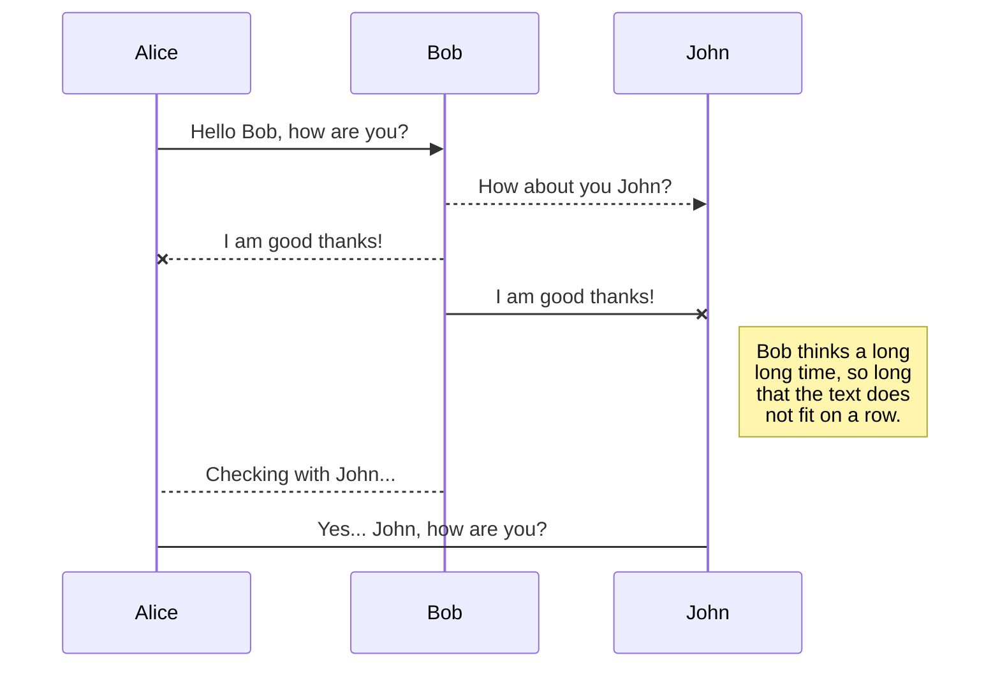

<h1 align="center" style="margin: 0;">Hi traveler, welcome to my codespace! 🪐</h1>

I'm a junior fullstack web developer based on Kassel, Germany.  Currently I am doing a bootcamp at super(code), Düsseldorf.

